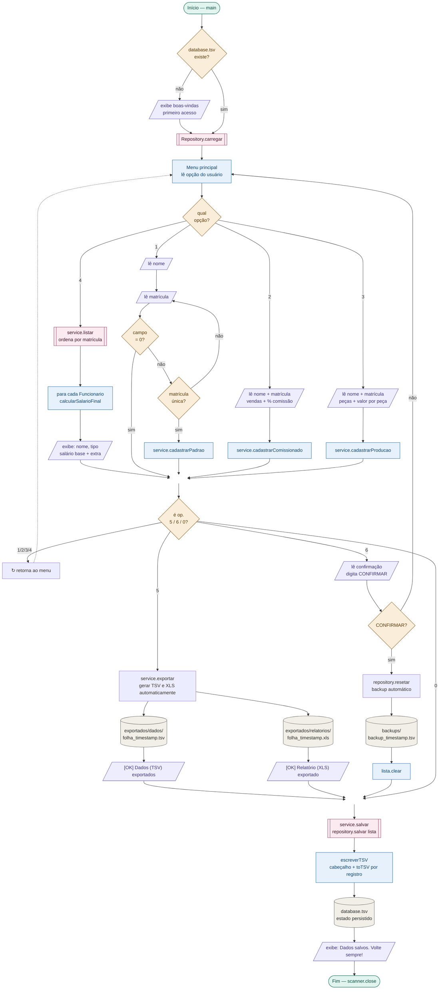

# 💼 Sistema de Folha de Pagamento

> Projeto desenvolvido como requisito de avaliação para a disciplina de **Algoritmos e Programação** — UC Dual em parceria com a **Oracle Academy**.  
> Curso: Análise e Desenvolvimento de Sistemas (ADS)

---

## 📌 Sobre o projeto

Sistema de folha de pagamento via terminal (console) que gerencia três perfis de funcionários, escolhidos pela UC Dual. Ele calcula salários automaticamente e persiste/exporta os dados localmente em TSV e XLS — sem banco de dados externo, sem dependências, sem internet.

A arquitetura foi organizada em camadas bem definidas para separar interface, regras de negócio e persistência. O projeto brinca bastante com pacotes em JAVA. Não sendo uma mera "maquiagem", pois cada camada faz exatamente o que o nome dela diz, e nada além disso.

---

## ⚙️ Funcionalidades

- **Três perfis de funcionário** com cálculo automático de salário:
  - **Padrão** — recebe apenas o salário base mensal
  - **Comissionado** — salário base + comissão sobre vendas
  - **Produção** — salário base + bônus por peças produzidas
- **Matrícula única** — o sistema rejeita duplicatas na hora
- **Nome normalizado automaticamente** — pode digitar em maiúsculo, minúsculo ou misturado
- **Geração de folha** — exibe todos os funcionários ordenados por matrícula
- **Exportação TSV e XLS com timestamp** — cada exportação gera um arquivo novo, nunca sobrescreve
- **Backup automático antes do reset** — nenhum dado é apagado sem rastro
- **Persistência automática** — ao sair pela opção 0, os dados são salvos; ao abrir, são restaurados

---

## 💻 Tecnologias e padrões

| Item | Detalhe |
|---|---|
| Linguagem | Java (JDK 17+) |
| Paradigma | POO — herança, polimorfismo, classes abstratas |
| Arquitetura | Camadas: `model / service / repository / ui / main` |
| Persistência | TSV e XLS local (sem banco de dados externo) |
| Versionamento | Git + GitHub |

---

## 📂 Estrutura do projeto

```
sistemaFolha/
├── src/
│   └── br/com/folha/
│       ├── main/
│       │   └── SistemaFolha.java          ← ponto de entrada
│       ├── model/
│       │   ├── Funcionario.java           ← classe base abstrata
│       │   ├── FuncionarioPadrao.java
│       │   ├── FuncionarioComissionado.java
│       │   └── FuncionarioProducao.java
│       ├── service/
│       │   └── FolhaService.java          ← regras de negócio
│       ├── repository/
│       │   └── FuncionarioRepository.java ← leitura e escrita em TSV e XLS
│       └── ui/
│           └── ConsoleUI.java             ← toda a interface do terminal
├── docs/
│   └── fluxograma-sistema-folha.html      ← documentação visual (ver abaixo)
└── README.md
```

Para adicionar um novo tipo de funcionário: crie a classe em `model/`, implemente os quatro métodos abstratos e adicione o `case` correspondente em `FuncionarioRepository`. Só isso. Parece simples, não é?

---

## 📊 Fluxograma do sistema


> Uma versão estendida do fluxograma, com simbologia ANSI completa e suporte a dark mode,
> está disponível em [`docs/fluxograma-sistema-folha.html`](./docs/fluxograma-sistema-folha.html)
> para visualização offline — basta abrir o arquivo no navegador, sem servidor ou dependências.

---

## 🚀 Como executar

### Opção 1 — Arquivo `.bat` (recomendada, somente Windows)

1. Tenha o **JDK 17+** instalado na máquina.
2. Coloque o arquivo `executar.bat` dentro da pasta do projeto (ao lado das pastas `src` e `bin`).
3. Dê dois cliques no `executar.bat`.

O sistema vai compilar e abrir automaticamente.

> **Obs.:** na primeira vez, o Windows pode exibir um aviso do SmartScreen — clique em **"Mais informações"** e depois em **"Executar assim mesmo"**.

---

### Opção 2 — Sua IDE favorita

1. Tenha o **JDK 17+** instalado na máquina.
2. Instale o suporte a Java na sua IDE (ex.: **Extension Pack for Java** no VS Code, ou use IntelliJ/Eclipse que já vêm com suporte nativo).
3. Abra a pasta do projeto na IDE e aguarde as extensões carregarem.
4. Navegue até `src/br/com/folha/main/`, abra o arquivo `SistemaFolha.java` e clique em **Run** acima do método `main` ou no topo da IDE.

Pronto. O terminal integrado vai abrir e o sistema vai iniciar.

---

### Opção 3 — Terminal (PowerShell ou bash)

1. Tenha o **JDK 17+** instalado na máquina.
2. Abra o terminal dentro da pasta do projeto. Só entrar na pasta e digitar **powershell** no topo, para windows.

3. Compile:

**Windows (PowerShell):**
```powershell
javac -encoding UTF-8 -d bin (Get-ChildItem -Recurse -Filter *.java src | % { $_.FullName })
```

**Linux / macOS:**
```bash
javac -encoding UTF-8 -d bin $(find src -name "*.java")
```

4. Execute:
```bash
java -cp bin br.com.folha.main.SistemaFolha
```

Se tudo correu bem, a primeira tela do sistema vai aparecer no terminal.

---

## 🖥️ Interface do sistema

No primeiro acesso, antes do menu, você verá:
```
===========================================
 Bem-vindo ao Sistema de Folha de Pagamento
      Versao 2.0  |  Salarios mensais
===========================================
  Este e o seu primeiro acesso.
  Nenhum funcionario cadastrado ainda.
-------------------------------------------
  Pressione ENTER para continuar...
```

Pressione ENTER. O menu principal vai aparecer:
```
===========================================
        FOLHA DE PAGAMENTO  (salarios mensais)
===========================================
  1 - Cadastrar Funcionario Padrao
  2 - Cadastrar Funcionario Comissionado
  3 - Cadastrar Funcionario de Producao
  4 - Gerar Folha de Pagamento
  5 - Exportar TSV e XLS  (copia com data e hora)
  6 - Resetar sistema  [ADM]
  0 - Sair
===========================================
  Opcao:
```

Digite o número da opção desejada e pressione ENTER.

---

## 📋 Guia de uso — opção por opção

<details>
<summary><strong>Opção 1 — Funcionário Padrão</strong></summary>

Para quem recebe apenas o salário fixo mensal, sem comissão ou bônus.

O sistema pede:
- **Nome** (pode digitar em qualquer caixa: `jose`, `JOSE` ou `Jose` — o sistema normaliza), evite acentos.
- **Matrícula** (número único de identificação)

</details>

<details>
<summary><strong>Opção 2 — Funcionário Comissionado</strong></summary>

Para quem recebe salário fixo + comissão sobre vendas.

O sistema pede:
- Nome
- Matrícula
- Total de vendas do mês (ex: `15000`)
- Percentual de comissão (ex: `5` para 5%)

**Cálculo:**
```
salário final = salário base + (vendas × percentual ÷ 100)
```

</details>

<details>
<summary><strong>Opção 3 — Funcionário de Produção</strong></summary>

Para quem recebe salário fixo + bônus por peças produzidas.

O sistema pede:
- Nome
- Matrícula
- Quantidade de peças produzidas no mês
- Valor pago por cada peça (ex: `3.50`)

**Cálculo:**
```
salário final = salário base + (quantidade × valor por peça)
```

</details>

<details>
<summary><strong>Opção 4 — Gerar Folha de Pagamento</strong></summary>

Exibe no terminal todos os funcionários cadastrados, ordenados por matrícula (do menor para o maior).

Para cada funcionário, você vê:
- Nome e matrícula
- Tipo (Padrão, Comissionado ou Produção)
- Salário base mensal
- Extras (comissão ou bônus, dependendo do tipo)
- **Total mensal a receber**

</details>

<details>
<summary><strong>Opção 5 — Exportar TSV e XLS</strong></summary>

Gera automaticamente duas cópias do cadastro atual: uma em TSV (dados brutos) e outra em XLS (relatório pronto pra visualização no Excel).

Os arquivos são salvos em:
```
exportados/folha_AAAA-MM-DD_HH-MM-SS.tsv
```


A data e hora no nome garantem que nada é sobrescrito — cada exportação cria um novo arquivo.

Na prática, o TSV fica como base de dados (mais seguro pra manipulação), enquanto o XLS já vem formatado pra leitura mais direta.

</details>

<details>
<summary><strong>Opção 6 — Resetar sistema [ADM]</strong></summary>

Apaga todos os funcionários e zera o sistema.

**Antes de apagar qualquer coisa**, um backup automático é salvo em:
```
backups/backup_AAAA-MM-DD_HH-MM-SS.tsv
```

Para confirmar o reset, você precisa digitar exatamente a palavra: `CONFIRMAR`

Qualquer outra entrada cancela a operação.

</details>

<details>
<summary><strong>Opção 0 — Sair</strong></summary>

Salva tudo automaticamente no arquivo `database.tsv` e encerra o programa.

Na próxima vez que abrir, todos os dados estarão lá, exatamente como você deixou.

</details>

---

## 🗂️ Arquivos gerados em execução

| Arquivo / Pasta | Função |
|---|---|
| `database.tsv` | Banco de dados principal — carregado ao abrir, salvo ao sair |
| `exportados/dados/` | Exportações em TSV (leitura por máquina e integração com Power BI) |
| `exportados/relatorios/` | Exportações em XLS (visualização direta no Excel) |
| `backups/` | Backups automáticos gerados antes de qualquer reset |

> Esses arquivos não fazem parte do repositório (estão no `.gitignore`).  
> Eles podem conter dados de funcionários — nomes, matrículas, salários.  
> Manter isso fora do Git é uma decisão de **privacidade e segurança**, mesmo que modesta.

O sistema usa o relógio do próprio computador para marcar data e hora nos arquivos. Não precisa de conexão com a internet.

---

## 🔢 Decisão de design — o `0` como cancelamento universal

Em qualquer campo, na hora do cadastro, digitar `0` cancela a operação e volta ao menu.

Essa escolha é inspirada em interfaces que qualquer pessoa já usou ou pelo menos conhece: sistemas de atendimento telefônico (como telemarketing) e e alguns tipos de controles remotos — onde `0` historicamente significa "voltar" ou "cancelar". É uma convenção que dispensa explicação.

Dentro deste projeto, a decisão é segura: todos os valores numéricos válidos respeitam limites mínimos definidos pelas regras de negócio (matrícula deve ser maior que zero, valores monetários são tratados como não-negativos com sinal de cancelamento separado).

Isso transforma uma escolha simples em **decisão de design consciente**.

**Onde mora o risco aqui? — No caso, não é no agora, é no futuro.**

Imagine que o sistema seja expandido:
- um novo campo aceita `0` como valor legítimo (desconto zero, horas extras zero, bônus zero);
- outro desenvolvedor mexe no código sem saber da convenção;
- ou, meses depois, a regra acaba sendo esquecida.

De repente, `0` volta a ser válido como dado — e o cancelamento vira uma armadilha silenciosa e uma dor de cabeça na certa.

Se o projeto for escalonado, a recomendação é substituir o `0` por uma entrada textual explícita, como uma variável char `c` ou String `cancelar`. Mais verboso, mas inequívoco.

---

## 🔧 Informações técnicas

**Salário base mensal atual:** `R$ 2.000,00`

Para alterar, edite a constante em:
```
src/br/com/folha/model/Funcionario.java
```
```java
public static final double SALARIO_BASE = 2000.00;
```

---

## 🛠️ Uso de ferramentas externas

Ao longo do desenvolvimento, recorreu-se pontualmente ao **Claude Code** como ferramenta de acompanhamento, não como substituto de raciocínio, mas como um par de olhos externo.

Os usos foram cirúrgicos e bem delimitados, e são explicados a seguir:

- **Comentários no código-fonte**: a empolgação falou mais alto no início, e o código saiu antes da documentação. Os comentários foram revisados com auxílio da ferramenta depois.
- **Partes do `model/` e do `repository/`**: orientação a objetos ainda é território em construção. Usou-se a ferramenta para validar decisões de herança e polimorfismo, não para gerá-las do zero.
- **Estética do fluxograma HTML**: cores e legenda receberam um ajuste com suporte externo para deixar a visualização mais apresentável.

O restante, arquitetura, lógica de negócio, estrutura de pacotes e decisões de design, foi desenvolvido manualmente. Além disso, o material disponibilizado pela **Oracle Academy** serviu como base de estudo ao longo de todo o projeto, e fez diferença.

---

*Projeto desenvolvido para fins acadêmicos — UC Dual Algoritmos e Programação | ADS*
