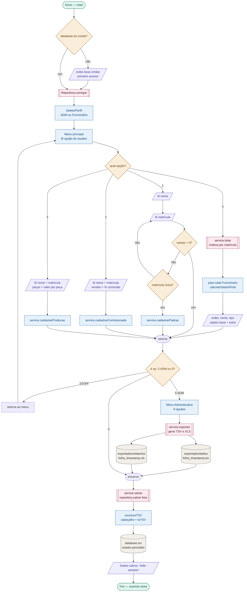

# 📊 Diagramas do Sistema

Diagramas de casos de uso e fluxograma do Sistema de Folha de Pagamento.  
Todos os diagramas de casos de uso foram elaborados manualmente e exibem versões distintas para modo claro e escuro do GitHub.

> Para o fluxograma interativo com simbologia ANSI completa, abra [`docs/fluxograma-sistema-folha.html`](./fluxograma-sistema-folha.html) diretamente no navegador — sem servidor, sem dependências.

---

## Fluxograma do sistema

---

## Diagramas de casos de uso

Os diagramas abaixo cobrem cada área funcional do sistema. Cada um identifica os atores envolvidos, as operações disponíveis e as regras de negócio aplicadas.

---

### UC-Perfis — Seleção de perfil de acesso

Tela exibida no início de cada sessão. No primeiro acesso (sem `database.tsv`), o sistema entra direto como Administrador. Nas sessões seguintes, o usuário escolhe entre **Funcionário** e **Administrador**.

<picture>
  <source media="(prefers-color-scheme: dark)"  srcset="../assets/uc_perfis_black.svg">
  <source media="(prefers-color-scheme: light)" srcset="../assets/uc_perfis_white.svg">
  
</picture>

---

### UC-00 — Visão geral dos menus

Mapa completo da navegação: menu de seleção de perfil, menu principal e menu administrativo com todas as suas opções.

<picture>
  <source media="(prefers-color-scheme: dark)"  srcset="../assets/uc00_menus_principais_black.svg">
  <source media="(prefers-color-scheme: light)" srcset="../assets/uc00_menus_principais_white.svg">
  
</picture>

---

### UC-01 — Cadastros de funcionários `[1] [2] [3]`

Cobre as três opções de cadastro do menu principal. Detalha os tipos disponíveis, as validações aplicadas e as regras de negócio — incluindo verificação de matrícula duplicada, alerta de nome similar e bloqueio de bônus acima do teto configurado.

<picture>
  <source media="(prefers-color-scheme: dark)"  srcset="../assets/uc01_cadastros_black.svg">
  <source media="(prefers-color-scheme: light)" srcset="../assets/uc01_cadastros_white.svg">
  
</picture>

---

### UC-02 — Gerar folha de pagamento `[4]`

Exibe todos os funcionários ordenados por matrícula com seus respectivos cálculos. Detalha as fórmulas por tipo e a aplicação do teto de bônus para funcionários de produção.

<picture>
  <source media="(prefers-color-scheme: dark)"  srcset="../assets/uc02_folha_black.svg">
  <source media="(prefers-color-scheme: light)" srcset="../assets/uc02_folha_white.svg">
  
</picture>

---

### UC-03 — Exportar e importar dados `(1) (2)`

Operações do menu administrativo para movimentação de dados. A exportação gera TSV (dados brutos) e XLS (relatório formatado), ambos com timestamp. A importação valida o formato antes de substituir a base, com backup automático obrigatório.

<picture>
  <source media="(prefers-color-scheme: dark)"  srcset="../assets/uc03_export_import_black.svg">
  <source media="(prefers-color-scheme: light)" srcset="../assets/uc03_export_import_white.svg">
  
</picture>

---

### UC-04 — Editar e remover funcionário `(4) (5)`

Operações individuais restritas ao Administrador. A edição permite trocar o tipo do funcionário (Padrão ↔ Comissionado ↔ Produção), com revalidação das regras de negócio. A remoção exige confirmação explícita.

<picture>
  <source media="(prefers-color-scheme: dark)"  srcset="../assets/uc04_edicao_remocao_black.svg">
  <source media="(prefers-color-scheme: light)" srcset="../assets/uc04_edicao_remocao_white.svg">
  
</picture>

---

### UC-05 — Novo mês e reset do sistema `(3) (6)`

Duas operações de ciclo de vida dos dados. O fechamento de mês arquiva o `database.tsv` em `/historico` com nomenclatura por data e zera variáveis mensais, mantendo o cadastro base. O reset apaga tudo com backup automático e requer a digitação de `CONFIRMAR`.

<picture>
  <source media="(prefers-color-scheme: dark)"  srcset="../assets/uc05_novo_mes_resetar_black.svg">
  <source media="(prefers-color-scheme: light)" srcset="../assets/uc05_novo_mes_resetar_white.svg">
  
</picture>

---

### UC-06 — Configurações do sistema `(7)`

Parâmetros configuráveis pelo Administrador: salário-base, teto de bônus (produção), limite de matrícula e modo de sequência (Rígido/Flexível). Todos são persistidos no `database.tsv` via linha `#CONFIG` e recarregados a cada inicialização.

<picture>
  <source media="(prefers-color-scheme: dark)"  srcset="../assets/uc06_configuracoes_black.svg">
  <source media="(prefers-color-scheme: light)" srcset="../assets/uc06_configuracoes_white.svg">
  
</picture>

---

### UC-07 — Edição em lote por tipo `(8)`

Permite atualizar parâmetros (como percentual de comissão ou valor por peça) para todos os funcionários de um mesmo tipo de uma só vez. O processamento acontece em memória e o TSV é reescrito apenas após validação individual de cada registro.

<picture>
  <source media="(prefers-color-scheme: dark)"  srcset="../assets/uc07_edicao_lote_black.svg">
  <source media="(prefers-color-scheme: light)" srcset="../assets/uc07_edicao_lote_white.svg">
  
</picture>

---

### UC-08 — Dashboard analítico `(9)`

Janela gráfica independente (JavaFX/Swing) que roda em paralelo ao console. Carrega os dados do `database.tsv` no startup, opera em modo leitura (não altera dados) e pode ser fechada sem encerrar o sistema principal. Contém abas de visão geral, listagem de funcionários com filtros e gráficos de relatório.

<picture>
  <source media="(prefers-color-scheme: dark)"  srcset="../assets/uc08_dashboard_black.svg">
  <source media="(prefers-color-scheme: light)" srcset="../assets/uc08_dashboard_white.svg">
  
</picture>
